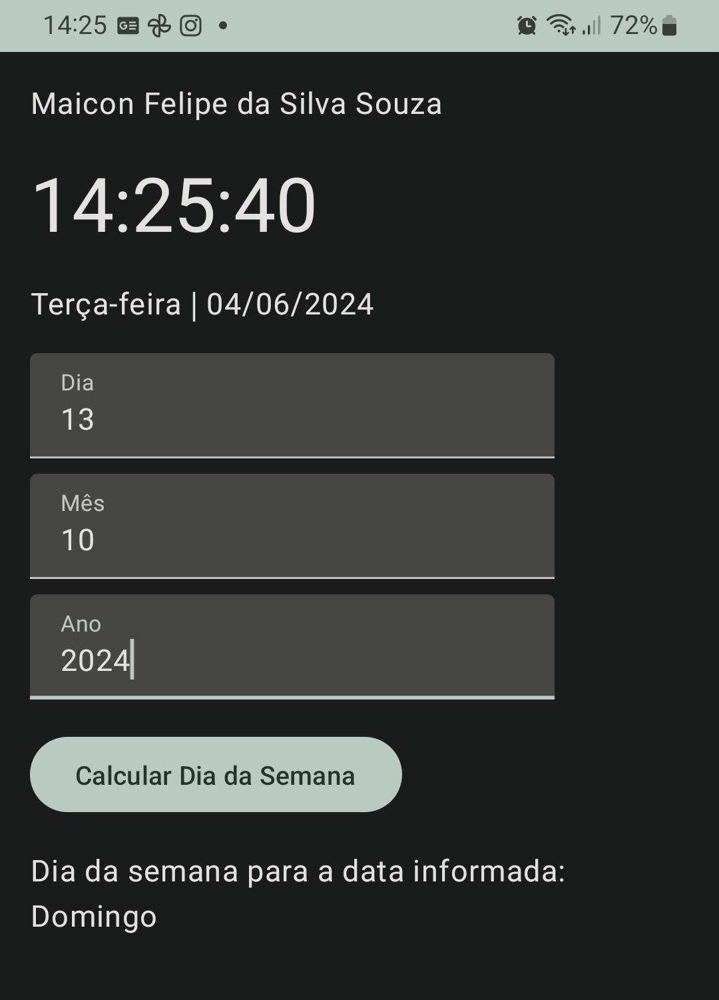

# DataApplication

## Descrição

Este é um aplicativo Android desenvolvido em **Kotlin** que exibe o **dia, data completa e hora atual (com minutos e segundos)** de forma dinâmica, atualizando-se automaticamente. Além disso, oferece um **formulário interativo** onde você pode digitar o dia, mês e ano para receber o **dia da semana correspondente**.

    

## Funcionalidades

- **Exibir Data, Dia e Hora Atuais**: Ao abrir o aplicativo, a data, o dia e a hora atuais são exibidos e atualizados automaticamente.
- **Formulário Interativo**: Um formulário onde você pode inserir uma data específica (dia, mês e ano).
- **Cálculo do Dia da Semana**: Com base na data inserida, o aplicativo calcula e exibe o dia da semana correspondente.

## Uso

1. **Abrir o Aplicativo**: Exibe automaticamente a data, o dia da semana e a hora atuais.
2. **Inserir Data**: Preencha os campos "Dia", "Mês" e "Ano".
3. **Calcular Dia da Semana**: Clique no botão "Calcular Dia da Semana" para ver o dia correspondente.

## Tema e Estilo

O aplicativo utiliza o tema **Material 3** e cores personalizadas para destacar as informações importantes.

## Autor

Maicon Felipe da Silva Souza